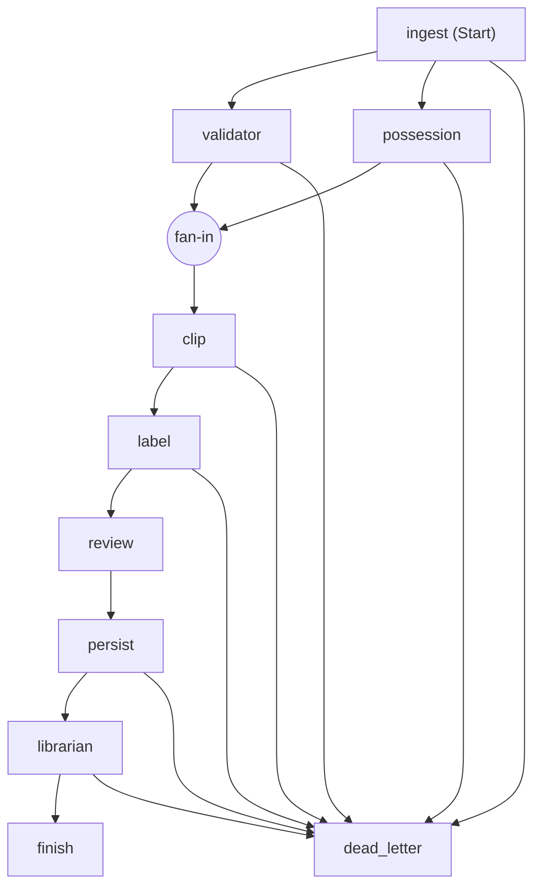

# Regista agent workflow (Microsoft Agent Framework)

Generated by `python -m regista.agents --graph docs/workflow.md`.

```mermaid
flowchart TD
  ingest["ingest (Start)"];
  validator["validator"];
  possession["possession"];
  clip["clip"];
  label["label"];
  review["review"];
  persist["persist"];
  librarian["librarian"];
  finish["finish"];
  dead_letter["dead_letter"];
  fan_in__clip__c9c283db((fan-in))
  possession --> fan_in__clip__c9c283db;
  validator --> fan_in__clip__c9c283db;
  fan_in__clip__c9c283db --> clip;
  ingest --> validator;
  ingest --> possession;
  clip --> label;
  label --> review;
  review --> persist;
  persist --> librarian;
  librarian --> finish;
  ingest --> dead_letter;
  validator --> dead_letter;
  possession --> dead_letter;
  clip --> dead_letter;
  label --> dead_letter;
  persist --> dead_letter;
  librarian --> dead_letter;
```
